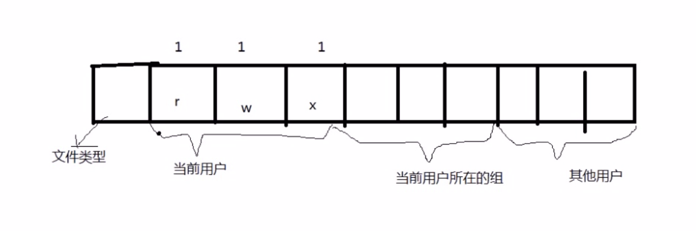
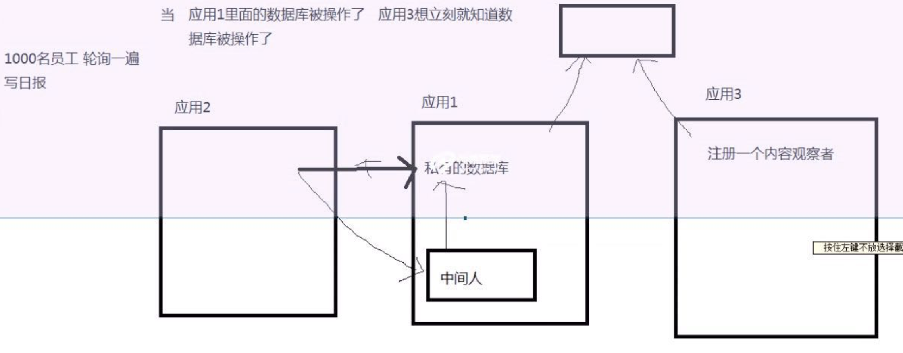

## 内容提供者

### 一 创建私有的数据库

1. 创建数据库

   ```java
   public class MyOpenHelper extends SQLiteOpenHelper {
   
   	/**
   	 * 
   	 * @param context
   	 * name 数据库的名字 
   	 * 
   	 * factory 游标工厂
   	 */
   	public MyOpenHelper(Context context) {
   		super(context, "Account.db", null, 1);
   	}
   
   	//表结构的初始化
   	@Override
   	public void onCreate(SQLiteDatabase db) {
   		db.execSQL("create table info(_id integer primary key autoincrement,name varchar(20),money varchar(20))");
   		db.execSQL("insert into info(name,money) values(?,?)", new String[]{"张三","5000"});
   		db.execSQL("insert into info(name,money) values(?,?)", new String[]{"李四","3000"});
   	}
   
   	@Override
   	public void onUpgrade(SQLiteDatabase db, int oldVersion, int newVersion) {
   
   	}
   
   }
   ```

2. 调用数据库

   ```java
   MyOpenHelper myOpenHelper = new MyOpenHelper(getApplicationContext());
   		SQLiteDatabase db = myOpenHelper.getReadableDatabase();
   		Cursor cursor = db.query("info", null, null, null, null, null, null);
   		if (cursor!=null && cursor.getCount()>0) {
   			while(cursor.moveToNext()){
   				String name = cursor.getString(1);
   				String phone = cursor.getString(2);
   				System.out.println("name"+name+"----"+phone);				
   			}
               db.close();
   }	
   ```

### 二 文件权限



1. 文件类型: `d`代表文件夹   `-`代表文件
2. 权限: `r`可读权限 `w` 可写权限  ` x`可执行权限
3. `chomd  777 文件名 ` 修改文件权限为`-rwxrwxrwx`

### 三 定义一个`ContentProvider`

1. 定义子类继承 ContentProvider

   ```java
   public class AccountProvider extends ContentProvider {
   }
   ```

2. 在清单文件中进行声明

   ```xml
   <!-- 配置内容提供者 -->
   <provider
      android:name="com.itheima.db.AccountProvider"
      android:authorities="com.itheima.provider" >
   </provider>
   
   1. authorities:是必须的，用来定义访问路径
   ```

3. ContentProvider中提供访问的方法

   ```java
   public class AccountProvider extends ContentProvider {
   	//[1]定义一个urimathcher  定义路径匹配器
   	private static final UriMatcher sURIMatcher = new UriMatcher(UriMatcher.NO_MATCH);
   	private static final int QUERYSUCESS = 0;  //ctrl + shift + X  
   	private static final int INSERTSUCESS = 1;
   	private static final int UPDATESUCESS = 2;
   	private static final int DELETESUCESS = 3;
   	private MyOpenHelper myOpenHelper;
   
   	 //[2] 定义静态代码块 添加匹配规则 
   	 static
   	    {
   		 /**
   		  * authority 注意  这个参数和你在清单文件里面定义的要一样 
   		  * 
   		  * Url  http://www.baidu.com
   		  *      
   		  * uri  content://com.itheima.provider/query     
   		  * content://com.itheima.provider/insert     
   		  * content://com.itheima.provider/update     
   		  * content://com.itheima.provider/query     
   		  */
   		 sURIMatcher.addURI("com.itheima.provider", "query", QUERYSUCESS);
   		 sURIMatcher.addURI("com.itheima.provider", "insert", INSERTSUCESS);
   		 sURIMatcher.addURI("com.itheima.provider", "update", UPDATESUCESS);
   		 sURIMatcher.addURI("com.itheima.provider", "delete", DELETESUCESS);		 
   	 }
   	 
   	 
   	@Override
   	public boolean onCreate() {
   		myOpenHelper = new MyOpenHelper(getContext());
   		return false;
   	}
   	
   	@Override
   	public Cursor query(Uri uri, String[] projection, String selection,
   			String[] selectionArgs, String sortOrder) {
   		int code = sURIMatcher.match(uri);
   		if (code == QUERYSUCESS) {
   			//说明路径匹配成功  把query方法给实现   数据库的查询方法  对数据库进行查询的操作  想操作数据库必须的获得sqltiedatabase对象
   			SQLiteDatabase db = myOpenHelper.getReadableDatabase();		
   			Cursor cursor = db.query("info", projection, selection, selectionArgs, null, null, sortOrder);
   			//cursor 不能关闭 注意		
   			//数据库被人操作 了 自己发送一条消息  
   			getContext().getContentResolver().notifyChange(uri, null);
   			return cursor;
   			
   		}else{
   			//路径不匹配
   			throw new IllegalArgumentException("哥们:您的路径不匹配 请检查路径");
   		}		
   	}
   
   	@Override
   	public String getType(Uri uri) {
   		return null;
   	}
       
   	@Override
   	public Uri insert(Uri uri, ContentValues values) {
   		int code = sURIMatcher.match(uri);
   		if (code == INSERTSUCESS) {
   			//操作数据库  说明路径匹配成功  
   			SQLiteDatabase db = myOpenHelper.getReadableDatabase();
   			//返回值代表新 插入行数的id
   			long insert = db.insert("info", null, values);
   			db.close();//关闭数据库
   			
   			if (insert>0) {
   				//发送一条消息 说明数据库发生了改变
   				getContext().getContentResolver().notifyChange(uri, null);
   			}			
   			
   			Uri uri2 = Uri.parse("com.itheima.insert/"+insert);
   			return uri2;			
   		}else{
   			//路径不匹配
   			throw new IllegalArgumentException("姐们:您的路径不匹配 请检查路径");
   		}		
   	}
   
   	@Override
   	public int delete(Uri uri, String selection, String[] selectionArgs) {
   		int match = sURIMatcher.match(uri);
   		if (match == DELETESUCESS) {
   			//说明路径匹配成功   对数据库进行删除的操作  
   			SQLiteDatabase db = myOpenHelper.getReadableDatabase();
   			//代表影响的行数
   			int delete = db.delete("info", selection, selectionArgs);
   			db.close();//关闭数据库
   			if (delete > 0) {
   				//发送一条消息 说明数据库发生了改变
   				getContext().getContentResolver().notifyChange(uri, null);
   			}			
   			return delete;
   		}else{
   			//路径不匹配
   			throw new IllegalArgumentException("爷们:您的路径不匹配 请检查路径");
   		}
   	}
   
   	@Override
   	public int update(Uri uri, ContentValues values, String selection,
   			String[] selectionArgs) {
   		
   		int code = sURIMatcher.match(uri);
   		if (code == UPDATESUCESS) {
   			SQLiteDatabase db = myOpenHelper.getReadableDatabase();
   			//影响的行数
   			int update = db.update("info", values, selection, selectionArgs);
   			
   			db.close();//关闭数据库
   			if (update > 0) {
   				//发送一条消息 说明数据库发生了改变
   				getContext().getContentResolver().notifyChange(uri, null);
   			}
   			return update;
   			
   		}else{
   			//路径不匹配
   			throw new IllegalArgumentException("爷们:您的路径不匹配 请检查路径");
   		}
   	}
   }
   
   ```

   4. 当出现下列日志时，说明内容提供者没有问题

      ```verilog
      ActivtyThread Pub com.itheima.provider: com.itheima.db.AccountProvider 
      ```

### 四 使用`ContentResolver`访问定义的`ContentProvider`

ContentProvider将一个应用内部的数据库暴露出来，其他应用使用ContentResolver访问其内部数据。

1. 对数据库增加一条记录

   ```java
   // 由于数据库的内容已经通过内容提供者暴露出来 所以我们只需要使用内容解析者去操作就可以了
   	public void click1(View v) {
           //根据定义ContentProvider时，提供的路径可知访问的Uri
   		Uri uri = Uri.parse("content://com.itheima.provider/insert");
   		ContentValues values = new ContentValues();
   		//key 对应表的字段  value 对应值
   		values.put("name", "zhaoliu");
   		values.put("money", 111111);
           //获取内容解析者
   		Uri insert = getContentResolver().insert(uri, values);
   		System.out.println("indert:"+insert);		
   		
   	}
   ```

2. 对数据库进行删除一条记录

   ```java
   public void click2(View v) {
   		Uri uri = Uri.parse("content://com.itheima.provider/delete");
   		int delete = getContentResolver().delete(uri, "name=?", new String[]{"zhaoliu"});
   		Toast.makeText(getApplicationContext(), "删除了"+delete+"行", 1).show();		
   	}
   ```

3. 对数据库进行修改一条记录

   ```java
   public void click3(View v) {
   		Uri uri = Uri.parse("content://com.itheima.provider/update");
   		ContentValues values = new ContentValues();
   		values.put("money", 0.000);
   		int update = getContentResolver().update(uri, values, "name=?", new String[]{"zhaoliu"});
   		Toast.makeText(getApplicationContext(), "更新了"+update+"行", 1).show();
   		
   	}
   ```

4. 对数据库进行查找一条记录

   ```java
   Uri uri = Uri.parse("content://com.itheima.provider/query"); // 路径和你定义的路径一样
   Cursor cursor = getContentResolver().query(uri, null, null, null, null);
   				if (cursor != null && cursor.getCount() > 0) {
   					while (cursor.moveToNext()) {
   						String name = cursor.getString(1);
   						String phone = cursor.getString(2);
   					System.out.println("~~~~第二个应用name" + name + "----" + phone);
   					}
   
   				}
   
   1. 第一个应用里面的私有数据库已经通过内容提供者给暴露出来了 所以可以直接通过内容的解析者进行访问
   2. getContentResolver() 获取内容解析者
   ```

### 五 短信的内容提供者

#### 1 备份短信

```java
//点击按钮 查询短信数据内容 然后进行备份 
	public void click(View v){
		try {
			//[1]获取xml序列化实例  
			XmlSerializer serializer = Xml.newSerializer();
			//[2]设置序列化参数 
			
			File file = new File(Environment.getExternalStorageDirectory().getPath(),"smsBackUp.xml");
			FileOutputStream fos = new  FileOutputStream(file);
			serializer.setOutput(fos, "utf-8");
			//[3]开始写xml文档开头 
			serializer.startDocument("utf-8", true);
			//[4]开始写根节点  
			serializer.startTag(null, "smss");
			//[5]由于短信数据库 系统也通过内容提供者给暴露出来了了 所以我们只需要通过内容解析者去操作数据库
			Uri uri = Uri.parse("content://sms/");
			Cursor cursor = getContentResolver().query(uri, new String[]{"address","date","body"}, null, null, null);
			while (cursor.moveToNext()) {
				String address = cursor.getString(0);
				String date = cursor.getString(1);
				String body= cursor.getString(2);
				//[6]写sms节点 
			
				serializer.startTag(null, "sms");
				//[7]写address节点 
				serializer.startTag(null, "address");
				serializer.text(address);
				serializer.endTag(null, "address");
				
				//[8]写body节点 
				serializer.startTag(null, "body");
				serializer.text(body);
				serializer.endTag(null, "body");
				
                //[9]写date节点 
				serializer.startTag(null, "date");
				serializer.text(date);
				serializer.endTag(null, "date");
				serializer.endTag(null, "sms");
			}
			serializer.endTag(null, "smss");
			serializer.endDocument();
		
		} catch (Exception e) {
			e.printStackTrace();
		}
    }

1. 获取sd卡路径 Environment.getExternalStorageDirectory().getPath()
2. 短信的ContentProvider的authorities为"sms"
```

```xml
短信的内容者在其清单文件的中的定义
<provider android:name="SmsProvider"
                  android:authorities="sms"
                  android:multiprocess="true"
                  android:readPermission="android.permission.READ_SMS"
                  android:writePermission="android.permission.WRITE_SMS" />

//添加访问权限
<uses-permission android:name="android.permission.WRITE_SMS"/>
<uses-permission android:name="android.permission.READ_SMS"/>
<uses-permission android:name="android.permission.WRITE_EXTERNAL_STORAGE"/>

```


#### 2 往短信里面插入数据

1. 通过查询短信的源码，可知`SmsProvider.java`中相关路径的定义

   ```java
   
       private static final UriMatcher sURLMatcher =
               new UriMatcher(UriMatcher.NO_MATCH);
   
       static {
           sURLMatcher.addURI("sms", null, SMS_ALL);
           sURLMatcher.addURI("sms", "#", SMS_ALL_ID);
           sURLMatcher.addURI("sms", "inbox", SMS_INBOX);
           sURLMatcher.addURI("sms", "inbox/#", SMS_INBOX_ID);
           sURLMatcher.addURI("sms", "sent", SMS_SENT);
           sURLMatcher.addURI("sms", "sent/#", SMS_SENT_ID);
           sURLMatcher.addURI("sms", "draft", SMS_DRAFT);
           sURLMatcher.addURI("sms", "draft/#", SMS_DRAFT_ID);
           sURLMatcher.addURI("sms", "outbox", SMS_OUTBOX);
           sURLMatcher.addURI("sms", "outbox/#", SMS_OUTBOX_ID);
           sURLMatcher.addURI("sms", "undelivered", SMS_UNDELIVERED);
           sURLMatcher.addURI("sms", "failed", SMS_FAILED);
           sURLMatcher.addURI("sms", "failed/#", SMS_FAILED_ID);
           sURLMatcher.addURI("sms", "queued", SMS_QUEUED);
           sURLMatcher.addURI("sms", "conversations", SMS_CONVERSATIONS);
           sURLMatcher.addURI("sms", "conversations/*", SMS_CONVERSATIONS_ID);
           sURLMatcher.addURI("sms", "raw", SMS_RAW_MESSAGE);
           sURLMatcher.addURI("sms", "attachments", SMS_ATTACHMENT);
           sURLMatcher.addURI("sms", "attachments/#", SMS_ATTACHMENT_ID);
           sURLMatcher.addURI("sms", "threadID", SMS_NEW_THREAD_ID);
           sURLMatcher.addURI("sms", "threadID/*", SMS_QUERY_THREAD_ID);
           sURLMatcher.addURI("sms", "status/#", SMS_STATUS_ID);
           sURLMatcher.addURI("sms", "sr_pending", SMS_STATUS_PENDING);
           sURLMatcher.addURI("sms", "icc", SMS_ALL_ICC);
           sURLMatcher.addURI("sms", "icc/#", SMS_ICC);
           //we keep these for not breaking old applications
           sURLMatcher.addURI("sms", "sim", SMS_ALL_ICC);
           sURLMatcher.addURI("sms", "sim/#", SMS_ICC);
   
           sConversationProjectionMap.put(Sms.Conversations.SNIPPET,
               "sms.body AS snippet");
           sConversationProjectionMap.put(Sms.Conversations.THREAD_ID,
               "sms.thread_id AS thread_id");
           sConversationProjectionMap.put(Sms.Conversations.MESSAGE_COUNT,
               "groups.msg_count AS msg_count");
           sConversationProjectionMap.put("delta", null);
       }
   }
   
   1. sms即为所有的短信
   ```

2. 直接通过内容解析者往短信数据库中插入一条数据

   ```java
   //点击按钮 往短信数据库里面插入一条数据 
   	public void click(View v) {
   		//由于短信数据库已经通过内容提供者暴露出来了 所以我们可以直接通过内容解析者 操作数据库
   		Uri uri = Uri.parse("content://sms");
   		ContentValues values = new ContentValues();
   		values.put("address", "110");
   		values.put("body", "王先生  请您马上来一趟 否则后果自负");
   		values.put("date", System.currentTimeMillis());
   		getContentResolver().insert(uri, values);		
   		
   	}	
   
   ```

3. 清单文件中添加访问权限

   ```java
   <uses-permission android:name="android.permission.WRITE_SMS"/>
   <uses-permission android:name="android.permission.READ_SMS"/>
   ```


### 六 联系人

#### 1  contact2.db的表结构

contact2.db中有data, mimetypes, raw_contacts三张表，以及view_data视图

data表中的raw_contact_id, mimetype_id, data1 字段是有效字段

| raw_contact_id | mimetype_id | data1              | .... |
| -------------- | ----------- | ------------------ | ---- |
| 1              | 5           | 18758010001        | ...  |
| 1              | 1           | 1822657131@qq.com  | ...  |
| 1              | 7           | kevin              |      |
| 2              | 5           | 18758010002        |      |
| 2              | 1           | 1922164286@qq.com  |      |
| 2              | 7           | xiaoming           |      |
| 3              | 5           | 18758010003        |      |
| 3              | 1           | 19221231231@qq.com |      |
| 3              | 7           | xiaohong           |      |

mimetypes表

| _id  | mimetype                                  |
| ---- | ----------------------------------------- |
| 1    | vnd.android.cursor.item/email_v2          |
| 2    | vnd.android.cursor.item/im                |
| 3    | vnd.android.cursor.item/nickname          |
| 4    | vnd.android.cursor.item/organization      |
| 5    | vnd.android.cursor.item/phone_v2          |
| 6    | vnd.android.cursor.item/sip_address       |
| 7    | vnd.android.cursor.item/name              |
| 8    | vnd.android.cursor.item/postal-address_v2 |
| 9    | vnd.android.cursor.item/identity          |
| 10   | vnd.android.cursor.item/photo             |
| 11   | vnd.android.cursor.item/group_membership  |

raw_contacts表中的contact_id

| contact_id | ...  |
| ---------- | ---- |
| 1          | ...  |
| 2          | ...  |
| 3          | ...  |

view_data视图

| raw_contact_id | mimetype                         | data1              | ...  |      |
| -------------- | -------------------------------- | ------------------ | ---- | ---- |
| 1              | vnd.android.cursor.item/phone_v2 | 18758010001        |      |      |
| 1              | vnd.android.cursor.item/email_v2 | 1822657131@qq.com  |      |      |
| 1              | vnd.android.cursor.item/name     | kevin              |      |      |
| 2              | vnd.android.cursor.item/phone_v2 | 18758010002        |      |      |
| 2              | vnd.android.cursor.item/email_v2 | 1922164286@qq.com  |      |      |
| 2              | vnd.android.cursor.item/name     | xiaoming           |      |      |
| 3              | vnd.android.cursor.item/phone_v2 | 18758010003        |      |      |
| 3              | vnd.android.cursor.item/email_v2 | 19221231231@qq.com |      |      |
| 3              | vnd.android.cursor.item/name     | xiaohong           |      |      |

#### 2 读取联系人

```java
public class ReadContactUtils {

	public static List<Contact> readContact(Context context){
		
		//[0]创建 集合对象 
		List<Contact> contactLists = new ArrayList<Contact>();
		//[1]由于联系人的数据库也是通过内容提供者暴露出来了  所以我想操作数据库直接使用内容解析者 
		//[2]先查询raw_contacts表  contact_id列
		Uri uri = Uri.parse("content://com.android.contacts/raw_contacts");
		Uri dataUri = Uri.parse("content://com.android.contacts/data");
		Cursor cursor = context.getContentResolver().query(uri, new String[]{"contact_id"}, null, null, null);
		while(cursor.moveToNext()){
			String contact_id = cursor.getString(0);
			if (contact_id!=null) {
			System.out.println("contact_id:"+contact_id);
			//创建javabean对象
			Contact contact = new Contact();
			contact.setId(contact_id);
			//[3]根据 raw_contact_id 去查询 data表    data1列和 mimetype_id 列
			//小细节 查询的不是data表  查询的是view_data的视图 
			Cursor dataCursor = context.getContentResolver().query(dataUri, new String[]{"data1","mimetype"}, "raw_contact_id=?", new String[]{contact_id}, null);
			
			while(dataCursor.moveToNext()){
				String data1 = dataCursor.getString(0);
				String mimetype = dataCursor.getString(1);
				if ("vnd.android.cursor.item/name".equals(mimetype)) {
					System.out.println("姓名:"+data1);
					contact.setName(data1);
				}else if("vnd.android.cursor.item/phone_v2".equals(mimetype)){
					System.out.println("电话号码:"+data1);
					contact.setPhone(data1);
				}else if("vnd.android.cursor.item/email_v2".equals(mimetype)){
					System.out.println("邮箱:"+data1);
					contact.setEmail(data1);
				}				
			}
			//把java bean对象加入到结合中 
			contactLists.add(contact);
			}
		}
		return contactLists;
	}	
}


1. 删除联系人，只是把raw_contact表中的对应的id变为null，其他表中的对应数据并没有被删除
```

```xml
//权限
<uses-permission android:name="android.permission.READ_CONTACTS"/>
```

#### 3 插入联系人

```java
//点击按钮 把用户输入的数据 插入到联系人数据库中
	public void click(View v) {
		
		//[2]获取数据
		String name = et_name.getText().toString().trim();
		String phone = et_phone.getText().toString().trim();
		String email = et_email.getText().toString().trim();
		
		//[2.1]定义uri
		Uri uri = Uri.parse("content://com.android.contacts/raw_contacts");
		Uri dataUri = Uri.parse("content://com.android.contacts/data");
		
		//[2.2]先查询一下raw_contacts表中一共有几条数据  行数+1 就是contact_id的值 
		Cursor cursor = getContentResolver().query(uri, null, null, null, null);
		int count = cursor.getCount();
		int contact_id = count + 1; //代表当前联系人的id
		//[3]把数据插入到 联系人数据库   由于联系人的数据库也是通过内容提供者暴露出来 所以我们直接通过内容解析者去操作数据库
		ContentValues values = new ContentValues();
		values.put("contact_id", contact_id);
		getContentResolver().insert(uri, values);
		
		//[4]把name phone email 插入到data 表 
		ContentValues nameValues = new ContentValues();
		nameValues.put("data1", name); //把数据插入到data1列
		nameValues.put("raw_contact_id",contact_id); //告诉数据库我们插入的数据属于哪条联系人 
		nameValues.put("mimetype", "vnd.android.cursor.item/name");//告诉数据库插入的数据的数据类型
		getContentResolver().insert(dataUri, nameValues);
		
		//[5]把phone 插入到data表
		ContentValues phoneValues = new ContentValues();
		phoneValues.put("data1", phone); //把数据插入到data1列
		phoneValues.put("raw_contact_id",contact_id); //告诉数据库我们插入的数据属于哪条联系人 
		phoneValues.put("mimetype", "vnd.android.cursor.item/phone_v2");//告诉数据库插入的数据的数据类型
		getContentResolver().insert(dataUri, phoneValues);
		//[6]把email 插入到data表
		ContentValues emailValues = new ContentValues();
		emailValues.put("data1", email); //把数据插入到data1列
		emailValues.put("raw_contact_id",contact_id); //告诉数据库我们插入的数据属于哪条联系人 
		emailValues.put("mimetype", "vnd.android.cursor.item/email_v2");//告诉数据库插入的数据的数据类型
		getContentResolver().insert(dataUri, emailValues);		
	}
```


### 七 内容观察者



注册一个内容观察者，观察数据的变化。

```java
public class MainActivity extends Activity {

	@Override
	protected void onCreate(Bundle savedInstanceState) {
		super.onCreate(savedInstanceState);
		setContentView(R.layout.activity_main);
		
		//[1]注册内容观察者 
		Uri uri = Uri.parse("content://com.itheima.provider");
		getContentResolver().registerContentObserver(uri, true, new MyContentObserver(new Handler()));		
	}

	//定义一个内容观察者 
	private class MyContentObserver extends ContentObserver{

		public MyContentObserver(Handler handler) {
			super(handler);
		}
		//当内容发送改变的时候调用
		@Override
		public void onChange(boolean selfChange) {
			
			System.out.println("哈哈哈 数据库的内容发送了改变 ");
			super.onChange(selfChange);
		}
		
	}
}

1. 注册内容观察者时，第二个参数为true，表明观察uri为前缀的变化
2. 之所以接收到通知是因为，当内容提供者操纵数据库的时候，发出了通知
	getContext().getContentResolver().notifyChange(uri, null);
```


### 八 观察短信变化

在SmsProvider.java中，操作完数据库后，会发送数据改变的通知


```java
public class MainActivity extends Activity {

	@Override
	protected void onCreate(Bundle savedInstanceState) {
		super.onCreate(savedInstanceState);
		setContentView(R.layout.activity_main);
		Uri uri = Uri.parse("content://sms");
		getContentResolver().registerContentObserver(uri, true, new MyContentObserver(new Handler()));		
	}

	//定义内容观察者 
	private class MyContentObserver extends ContentObserver{
		public MyContentObserver(Handler handler) {
			super(handler);
		}
		@Override
		public void onChange(boolean selfChange) {
			System.out.println("哈哈 短信的数据库内容发送了改变");
			//把body  address  date 取出来
			
			super.onChange(selfChange);
		}
	}
}

```


