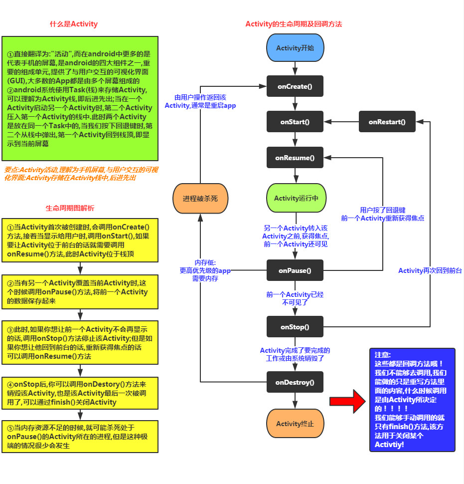

## Activity笔记

### 一  如何创建一个新的Activity

1. android的四大组件都要在清单文件里进行配置，参考第二点

2. 如果你想要有多个应用图标，在AndroidManifest.xml中可以配置

   ```xml
   <application
           android:allowBackup="true"
           android:icon="@drawable/ic_launcher"
           android:label="@string/app_name"
           android:theme="@style/AppTheme" >
           <activity
               android:name="com.itheima.newactivity.MainActivity"
               android:icon="@drawable/head1"
               android:label="我是第一个页面" >
               <!-- main 主入口 -->
               <intent-filter>
                   <action android:name="android.intent.action.MAIN" />
                   <category android:name="android.intent.category.LAUNCHER" />
               </intent-filter>
           </activity>
           <!-- 配置testActivity -->
           <activity
               android:name="com.itheima.newactivity.TestActivity"
               android:icon="@drawable/head2"
               android:label="我是第二个页面" >
               <!-- main 主入口 -->
               <intent-filter>
                   <action android:name="android.intent.action.MAIN" />
                   <category android:name="android.intent.category.LAUNCHER" />
               </intent-filter>
           </activity>
       </application>
   
   1. 此时运行起来的应用，在桌面上有两个启动图标，icon分别为head1, head2。名字分别为"我是第一个页面","我是第二个页面"
   2. <activity>节点下的icon,label等属性会覆盖<application>节点下对应的属性。<activity>节点不设置时，默认会取<application>节点下的属性。
   3. <intent-filter>意图过滤器节点中, 如果<action android:name="android.intent.action.MAIN" />, <category android:name="android.intent.category.LAUNCHER" />,那么代表这个activity是启动后的第一个页面
   ```


### 二 意图

#### 2.1 隐式意图

>  通过指定一组动作或者数据开启隐式意图

1. 在AndroidManifest.xml中对应的`<activity>`节点需要设置了对应的意图过滤器

   ```xml
      <activity
               android:name="com.itheima.newactivity.TestActivity"
               android:icon="@drawable/head2"
               android:label="我是第二个页面" >
               <intent-filter>
                   <action android:name="com.itheima.testactivity" />
                   <category android:name="android.intent.category.DEFAULT" />
                   <data
                       android:mimeType="aa/bb"
                       android:scheme="itheima" />
               </intent-filter>
   
               <intent-filter>
                   <action android:name="com.itheima.testactivity" />
                   <category android:name="android.intent.category.DEFAULT" />
                   <data
                       android:mimeType="aa/bb1"
                       android:scheme="itheima1" />
               </intent-filter>
            </activity>
   
   1. activity节点下可以设置多组意图过滤器，但是跳转的时候必须匹配到一组意图过滤器
   2. <intent-filter>节点:
       2.1 <action>指定跳转的动作
       2.2 <category>指定跳转的类别
       2.3 <data>指定跳转时传递的数据
           2.3.1 mimeType: 指定数据类型
           2.3.2 scheme: 指定协议
   ```


2. 创建跳转时对应的Intent，匹配意图过滤器，进行跳转

   ```java
   //[1]创建意图对象   意图就是我要完成一件事 
     Intent intent = new Intent();
   //[2] 设置跳转的动作 
     intent.setAction("com.itheima.testactivity");
   //[3] 设置category
     intent.addCategory("android.intent.category.DEFAULT");
   //[4]设置数据 
   // intent.setData(Uri.parse("itheima:"+110));
   //[5]设置数据类型 
   //intent.setType("aa/bb");
   //[6]注意 小细节☆  如果需要setdata 方法和 settype 方法一起使用的时候  应该使用下面这个方法 
      intent.setDataAndType(Uri.parse("itheima1:"+110), "aa/bb1");	    
   //[7]开启Activity  
      startActivity(intent);
   
   1. 使用setData方法时会清除setType设置的数据类型， 使用setType方法时会清除setData设置的数据,所以这两个方法不能同时使用。如果要同时设置数据和类型，使用setDataAndType方法。
   2. 在TestActivity中,可以通过下面方法获取数据 
        Intent intent = getIntent().getData();
   	 Uri data = intent.getData();
   ```

#### 2.2  显式意图

> 通过指定具体的包名和类名来开启显式意图

1. 先在AndroidManifest.xml中进行声明

   ```xml
    <!--配置Activity3  -->
    <activity android:name="com.itheima.newactivity.Test3Activity"></activity>
   
   1. 从上面可知，显式意图，仅仅只是进行声明，并没有指定意图过滤器
   ```

2. 创建并开启意图

   ```java
   方法1 
   //[1]创建意图对象
    Intent intent = new Intent();
   //[2]设置包名和类名  packageName:当前应用的包名
   intent.setClassName("com.itheima.newactivity", "com.itheima.newactivity.Test3Activity"); 
   //[3]开启Activity  
   startActivity(intent);
   
   方法2
   //[1]创建意图对象
    Intent intent = new Intent(this,Test3Activity.class);
   //[2]开启Activity  
   startActivity(intent);
   ```


#### 2.3 传递数据

##### 2.3.1 从A界面传递给B界面

1. 在Intent中，通过`putExtra`方法进行页面间数据的传递

   ```java
   //[4]跳转到ResultActivity页面   用显示意图跳转
   Intent intent = new Intent(this, ResultActivity.class);
   //传递姓名
   intent.putExtra("name", name);
   //传递性别 
   intent.putExtra("sex", sex);		
   startActivity(intent);		
   ```

2. 在对应页面取出数据

   ```java
   // 获取开启此Activity的意图对象
   Intent intent = getIntent(); 
   //获取name 和 sex 的值 
   String name = intent.getStringExtra("name");
   int sex = intent.getIntExtra("sex", 0);
   
   1. 小技巧:传递的是什么数据类型 这边就按照传递的数据类型取
   ```

##### 2.3.2 从B界面传递给A界面（请求码和结果码）

1. 从A界面开启B界面时，使用`startActivityForResult`方法

   ```java
   Intent intent = new Intent(this,ContactActivity.class);
   //小细节 如果点击按钮 开启了另外一Activity   并且当开启的这个Activity关闭的时候  我想要这个开启Activity的数据  用下面这个方法开启activity
   startActivityForResult(intent, 1);	//请求码:1
   ```

2. 从B界面回传数据，并关闭页面

   ```java
   Intent intent = new Intent();
   intent.putExtra("phone", phone);
   setResult(10, intent);//结果码:10
   finish();
   ```

3. 在A界面中处理数据

   ````java
   //当我们开启的Activity 页面关闭的时候 这个方法就调用
   @Override
   protected void onActivityResult(int requestCode, int resultCode, Intent data) {
   	if (requestCode==1) {
   		//代表请求ContactActivity这个页面的数据 
   		String phone = data.getStringExtra("phone");
   		et_number.setText(phone);
   	}	
   }
   ````

#### 2.4  隐式和显式意图比较

1. 开启自己应用的界面用显式意图
2. 开启其他应用(系统应用)的界面用隐式意图
3. 显式意图更安全一些

### 三 Activity的生命周期


#### 3.1 生命周期图



+ 参考 [Activity的生命周期](https://www.cnblogs.com/nylcy/p/6500832.html)

#### 3.2 生命周期方法

1. onCreate : 当activity第一次创建的时候调用
2. onRestart: 当activity再次可见的时候调用
3. onStart：当activity可见的时候调用
4. onResume: 当activity可以交互的时候调用
5. onPause：当activity失去交互的时候调用
6. onStop: 当activity不可见的时候调用
7. ondestory：当 activity销毁的时候调用

#### 3.3 横竖屏切换

1. 如果不进行配置的话，那么横竖屏切换后，会先销毁再创建。 当前activity的生命周期如下

   ```java
   1. onPause
   2. onStop
   3. ondestory
   4. onCreate
   5. onStart
   6. onResume
   ```

2. 可以指定activity的横竖屏方向,这样横竖屏就固定了

   ```java
    android:screenOrientation="portrait"//横屏
    android:screenOrientation="landscape"//竖屏
   ```

### 四 任务栈

1. 栈:先进后出  
2. 打开一个activity叫进栈，关闭一个activity叫出栈
3. 我们操作的activity永远都是栈顶的activity
4. 任务栈是用来维护用户的操作体验的
5. 应用程序退出了就是任务栈清空了(此时进程还没有被杀死，只有进程被杀死，应用才真正完全退出)
6. 一般清空下一个应用程序对应一个任务栈

### 五 Activity的四种启动模式

通过Activity节点下的`android:launchMode`指定启动模式

#### 5.1 standard模式

 ```
标准模式:默认的启动模式，每开启一个activity就往栈顶添加一个元素，每关闭一个activity就把当前栈顶的元素移除

例如: Activity1和Activity2都是standard模式
1. 开启Activity1  ====  任务栈: [Activity1]->栈顶
2. 开启Activity2  ====  任务栈: [Activity1, Activity2]->栈顶
3. 开启Activity1  ====  任务栈: [Activity1, Activity2,Activity1]->栈顶
4. 开启Activity2  ====  任务栈: [Activity1, Activity2,Activity1, Activity2]->栈顶
4. 开启Activity2  ====  任务栈: [Activity1, Activity2,Activity1, Activity2,Activity2]->栈顶
 ```

#### 5.2 singleTop模式

```
单一顶部模式: 如果当前栈顶存在的activity与将要开启的activity类名一样，那么不会创建新的activity,直接复用栈顶的activity。

例如: Activity1是standard模式, Activity2是singleTop模式
1. 开启Activity1  ====  任务栈: [Activity1]->栈顶
2. 开启Activity2  ====  任务栈: [Activity1, Activity2]->栈顶
3. 开启Activity1  ====  任务栈: [Activity1, Activity2,Activity1]->栈顶
4. 开启Activity2  ====  任务栈: [Activity1, Activity2,Activity1, Activity2]->栈顶
5. 开启Activity2  ====  任务栈: [Activity1, Activity2,Activity1, Activity2]->栈顶 

如上第5步所示,在栈顶的Activity是Activity2,再次开启则复用栈顶的Activity2
```

#### 5.3 singleTask模式

```
单一任务栈,在当前任务栈里面只能有1个实例存在。当开启activity的时候，就去检查任务栈里面是否有实例存在，如果存在，那么就复用这个实例，并把这个实例上面所有的activity清空。

例如: Activity1是standard模式, Activity2是singleTask模式
1. 开启Activity1  ====  任务栈: [Activity1]->栈顶
2. 开启Activity2  ====  任务栈: [Activity1, Activity2]->栈顶
3. 开启Activity1  ====  任务栈: [Activity1, Activity2,Activity1]->栈顶
4. 开启Activity2  ====  任务栈: [Activity1, Activity2]->栈顶

如上第4步所示,任务栈中已经存在Activity2的实例，那么复用已经存在Activity2实例,并清空其上面的activity
```

#### 5.4 singleInstance模式

```
启动模式非常特殊，该activity会运行在自己的任务栈内，并且这个任务栈里面只有一个实例存在。(例如:来电页面)

例如: Activity1是standard模式, Activity2是singleInstance模式
1. 开启Activity1  ====  任务栈1: [Activity1]->栈顶
2. 开启Activity2  ====  任务栈2: [Activity2]->栈顶 
                       任务栈1: [Activity1]->栈顶 
                       ***任务栈2在前显示
3. 开启Activity1  ====  任务栈1: [Activity1,Activity1]->栈顶  
                        任务栈2: [Activity2]->栈顶
                        ***任务栈1在前显示 
4. 开启Activity2  ====  任务栈2: [Activity2]->栈顶
                       任务栈1: [Activity1,Activity1]->栈顶  
                       ***任务栈2在前显示       
                       
                       
1. 如上第2，3步所示,在栈顶的Activity2单独在一个任务栈中，并且无论添加多少次，只有一个实例存在。
2. Activity1，Activity2交替显示，实际上是因为两个任务栈的前后顺序在改变。
```


###  扩展

#### 1 隐式意图拨打电话

1. 通过查看系统应用Phone的源码，在其AndroidManifest.xml中,找到开启隐式意图所需的参数

   ```xml
    <activity android:name="OutgoingCallBroadcaster"
                   android:permission="android.permission.CALL_PHONE"
                   android:theme="@android:style/Theme.NoDisplay"
                   android:configChanges="orientation|keyboardHidden">
               <!-- CALL action intent filters, for the various ways
                    of initiating an outgoing call. -->
               <intent-filter>
                   <action android:name="android.intent.action.CALL" />
                   <category android:name="android.intent.category.DEFAULT" />
                   <data android:scheme="tel" />
               </intent-filter>
               <intent-filter android:icon="@drawable/ic_launcher_sip_call">
                   <action android:name="android.intent.action.CALL" />
                   <category android:name="android.intent.category.DEFAULT" />
                   <data android:scheme="sip" />
               </intent-filter>
               <intent-filter>
                   <action android:name="android.intent.action.CALL" />
                   <category android:name="android.intent.category.DEFAULT" />
                   <data android:scheme="voicemail" />
               </intent-filter>
               <intent-filter>
                   <action android:name="android.intent.action.CALL" />
                   <category android:name="android.intent.category.DEFAULT" />
                   <data android:mimeType="vnd.android.cursor.item/phone" />
                   <data android:mimeType="vnd.android.cursor.item/phone_v2" />
                   <data android:mimeType="vnd.android.cursor.item/person" />
               </intent-filter>
           </activity>
   ```

2. 在自己的AndroidManifest.xml中添加打电话的权限

   ```xml
   <uses-permission android:name="android.permission.CALL_PHONE" />
   ```

3. 匹配一个意图过滤器即可

   ```java
   //[1]创建意图对象 
   Intent intent = new Intent();
   //[2] 设置拨打的动作 
   intent.setAction(Intent.ACTION_CALL);
   //[3]设置拨打的数据 
   intent.setData(Uri.parse("tel:"+119)); 
   //[4]开启Activity  记得加上权限
   startActivity(intent);
   ```

#### 2 隐式意图发短信

1. 进入系统短信的发送页面，从系统的log中可知Activity为`ComposeMessageActivity`

   ```shell
   Displayed com.android.mms/.ui.ComposeMessageActivity: +610ms
   ```

2. 通过查看系统应用Mms的源码，在其AndroidManifest.xml中,找到开启隐式意图所需的参数

   ```xml
   <intent-filter>
     <action android:name="android.intent.action.SEND" />
     <category android:name="android.intent.category.DEFAULT" />
     <data android:mimeType="text/plain" />
   </intent-filter>	
   ```

3. 通过查看系统应用Mms的源码，在`ComposeMessageActivity`中通过getStringExtra找到短信对应的字段为`sms_body`

   ```java
   Intent intent = new Intent();
   intent.setAction("android.intent.action.SEND");
   intent.addCategory("android.intent.category.DEFAULT");
   intent.setType("text/plain");
   intent.putExtra("sms_body", content);
   startActivity(intent);	
   ```

#### 3 分段发送短信

1. 添加发送短信的权限

   ```xml
   <uses-permission android:name="android.permission.SEND_SMS"/>
   ```

2. 使用`SmsManager`分段发送短信

   ```java
   SmsManager smsManager = SmsManager.getDefault();
   ArrayList<String> divideMessages = smsManager.divideMessage(content);
   for (String div : divideMessages) {			
   	/**
   	  * destinationAddress  发送给谁 
   	  * scAddress  服务中心号码
   	  * 
   	  * text 要发送的内容
   	  */
   	smsManager.sendTextMessage(number, null, div, null, null);
   }
   
   1. 使用SmsManager发送短信时，短信内容长度限制为英文字符140个或中文70个字符。所以如果超出内容限制的时候，需要分段发送
   ```

#### 4 透明应用

```xml
 <application
        ....
        android:theme="@android:style/Theme.Translucent.NoTitleBar.Fullscreen" >
        ....
 </application>
```


